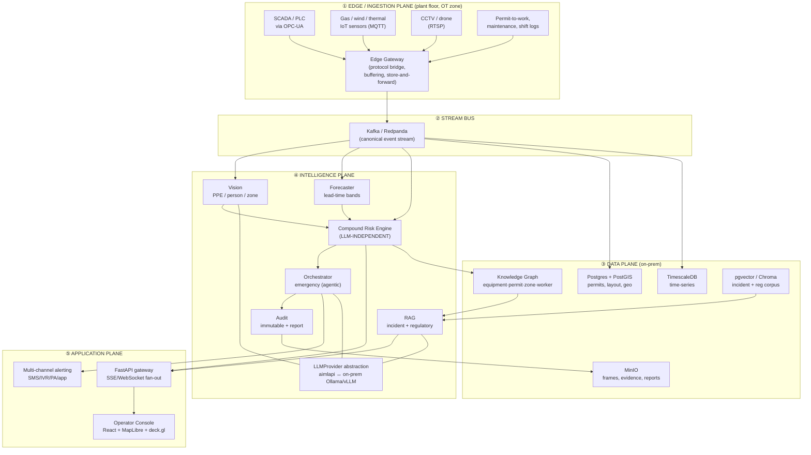

# Verge — Product & Architecture Specification

> **Name:** Verge
> **One line:** *The lead-time intelligence layer for zero-harm industrial operations.*
> **Tagline:** *"Verge sees it before the threshold."*
> **Targets:** ET AI Hackathon 2026 — Problem Statement #1, *AI-Powered Industrial Safety Intelligence for Zero-Harm Operations*. Funded flagship build, multi-month pilot runway.
> **Status:** v0.3 design spec. Supersedes v0.2/v0.1 and the VesperGrid hackathon prototype (concept retained; implementation rebuilt for production).
> **Demo scenario:** *Maya, Safety Officer, 06:42 shift changeover* — a Vizag-*reconstructed* coke-oven plant, replayed against a synthetic timeline derived from the Jan 2025 public incident reports.

---

> ⚠️ **Reading note on numbers.** Every quantitative figure in this spec (lead times, recall/FPR, latencies, $/incident) is a **TARGET, not a measured result** — no harness, model, or dataset exists yet. Nothing here goes into a deck or demo until the eval harness (§10) reproduces it. Tables marked `TARGET` are aspirations to earn, not facts.

---

## 0. Why this exists (the thesis)

PS#1's own evidence is the spec: at **Visakhapatnam Steel Plant (Jan 2025)**, eight workers died even though gas detectors, permit-to-work controls, and SCADA were all *functioning*. The warning signals existed in the data. **No intelligence layer connected those readings to a decision in time.**

That single sentence defines the product. The market does not need another dashboard — plants are already full of gas detectors, SCADA, and permit systems, and people still die. The unmet need is a layer that:

1. **Fuses** disparate streams (gas/IoT, SCADA, permit-to-work, maintenance, shift logs, CCTV) into one risk picture.
2. **Detects compound risk** — dangerous *combinations* no single sensor flags (e.g., a hot-work permit issued near a tank with rising gas during a shift changeover).
3. **Predicts lead time** to threshold breach — acts *before* the incident, with hours of warning.
4. **Closes the loop** — alerts the right people, triggers protocols, preserves evidence, and produces a regulator-ready record.
5. **Never lies about uncertainty** and **never loses its source lineage** — every alert traces to the exact readings that caused it.

And it must do all of this **inside an air-gapped plant network**, because that is where the buyers are.

### What "Verge" means in this product

The *verge* is the moment before a trajectory becomes irreversible — the lead time between "all readings are within band" and "the threshold has been breached and the operator has seconds." Verge is the intelligence layer that operates *in the verge*: not the alarm panel, not the historian, not the chat-Copilot bolted onto the SCADA HMI. The thing that lives in the lead time, that the buyer cannot see with any other tool, and that no single sensor can compute alone.

The product name maps to the moment, not the description. A closed Verge finding reads: *"Flagged gas-permit-shift-changeover convergence in the `NEAR` band; operator pivoted at minute 14; outcome: no breach."* You don't configure a threshold and wait — you operate in the lead time.

---

## 1. Design principles (non-negotiable)

| # | Principle | Why it matters |
|---|---|---|
| **P1** | **Fail-operational safety core.** The detection → alert → evacuate path runs on deterministic rules + classic ML, **on-prem, with zero dependency on any LLM or cloud.** | A plant with the internet cut, or air-gapped by policy, must still be protected. The LLM is the *explanation/intelligence* layer, never the safety interlock. This is the single most important design decision. |
| **P2** | **Open-source / sovereign by default — our core leverage.** Every core component is OSS and self-hostable. The LLM is a *swappable provider* — aimlapi.com today, on-prem Ollama/vLLM tomorrow, same interface. | No vendor lock, fully auditable, deployable air-gapped. This is the commercial moat for heavy industry and the public sector. |
| **P3** | **Source lineage end-to-end.** Every risk, alert, and action links to the raw evidence (sensor reading, permit ID, CCTV frame, log line). | Operators cannot trust a black box in a crisis; regulators require an audit trail. Carried over from VesperGrid — it was the genuinely good idea. |
| **P4** | **Honest uncertainty and sustained operator trust.** Contradictions between sources are surfaced, not smoothed over. False alarms are explicitly captured, learned from, and reduced. Confidence is explicit; false-negative cost is weighted far above false-positive. **A muted system has a 100% false-negative rate** — alert-fatigue is the #1 killer of deployed safety software, and is treated as a first-class capability (see §4.6). | The metric that saves lives is the false-negative rate. But a system that cries wolf is a system that gets muted. Verge optimizes for both: "never miss" **and** "never become background noise." |
| **P5** | **Eval-driven, replay-provable.** Every claim (lead time, accuracy vs single-sensor baseline) is backed by an automated eval harness that can **replay historical incidents** (e.g., a reconstructed Vizag timeline). | PS#1 is *scored on metrics*. The prototype had no eval. This is our proof and our differentiator. |
| **P6** | **Immutable, signed audit.** Every automated decision and action is append-only, hash-chained, timestamped, and attributable. | "Regulatory-compliant incident report" + legal admissibility (OISD/Factory Act/DGMS). |
| **P7** | **Edge-first ingestion.** Heavy/sensitive processing happens at the plant edge; only de-identified aggregates ever (optionally) leave. | Bandwidth, latency, and OT-network segmentation reality. |
| **P8** | **Decision support, not automation.** Verge is decision-support, not a safety-instrumented system. Every automated output is shown to the operator before any irreversible action. No Verge component writes to control systems. No Verge component triggers ESD. No Verge component auto-suppresses a finding. **The operator is the safety interlock.** The product earns autonomy progressively, it doesn't ship with it. | Liability, trust, regulatory defensibility, and operational honesty. A safety product that "automates" the alarm panel is a product that gets uninstalled after the first near-miss. |

---

## 2. System architecture (five planes)



**Reading the planes:**

- **① Edge / Ingestion** — sits in the OT zone (Purdue L2–L3). An **Edge Gateway** normalizes everything: OPC-UA for SCADA/PLC, MQTT (Mosquitto) for IoT sensors, RTSP for cameras, file/DB connectors for permit/maintenance/shift systems. It buffers and store-and-forwards so a network blip never drops safety data.
- **② Stream bus** — Kafka/Redpanda is the single canonical event spine. Everything downstream subscribes; nothing is point-to-point (this fixes the prototype's fragile single-consumer SSE).
- **③ Data plane** — TimescaleDB (sensor time-series), Postgres+PostGIS (permits, plant layout, geo zones), a **knowledge graph** (the relationships that make compound risk possible), pgvector/Chroma (incident + regulatory corpus for RAG), MinIO (frames, evidence packs, reports).
- **④ Intelligence plane** — the **Compound Risk Engine is LLM-independent** (P1). LLM-backed components (RAG, orchestrator narrative, optional CV enrichment) all go through one `LLMProvider` so the model can be cloud (aimlapi) or on-prem with no code change.
- **⑤ Application plane** — FastAPI gateway with proper SSE/WebSocket fan-out, the **operator console** (geo heatmap + risk + uncertainty ledger), multi-channel alerting, and the immutable audit/report generator.

---

## 3. The lead-time intelligence layer (the wedge)

This is the section v0.1 lacked. **For the hackathon and the first pilot, Verge is one product with one job** — the lead-time wedge below. The 8-pillar platform (§5–§6) is the multi-year *vision* the wedge grows into; it is deliberately out of scope for the hackathon slice. Holding both in view without conflating them is the point:

> **The lead-time intelligence layer that fuses compound risk + temporal forecasting + source lineage + eval-replayable evidence into a single, deterministic, on-prem safety core that operates in the lead time before a threshold breach.**

Four things together. Each is required. None alone is the product.

| Component | What it does | Why it's the wedge |
|---|---|---|
| **Compound Risk Engine** *(`risk-engine`)* | Correlates gas/IoT, permits, maintenance, shift, and weather to flag dangerous *combinations* no single sensor sees. | Catches the Vizag-style convergence in the demo. The "SIMOPS detection" the PDF calls out. |
| **Lead-Time Forecaster** *(`forecaster`)* | Projects time-to-threshold on every flagged reading as a **lead-time band** (not a point estimate). | The thing the judging criterion literally scores — *"prediction lead time before incident threshold."* |
| **Source Lineage** *(every Verge component)* | Every finding links to the raw evidence that produced it — sensor ID, permit ID, frame timestamp. | The audit trail the regulator demands. The trust mechanism the operator needs. |
| **Eval-Replayable** *(the eval harness)* | A documented, automated harness that replays reconstructed historical incidents and reports recall, lead-time band, and FPR vs. **all three baselines (B0 fixed-threshold, B1 rate-of-rise, B2 multi-sensor AND-gate)** — on every CI run. | Converts "we built an AI safety platform" from a claim into a *reproducible* artifact. (A strong demo, not unbiased proof — see §10.) |

Every other capability in §5 is **supporting** — they're how a buyer operationalizes the wedge, but the wedge itself is the four items above.

---

## 4. The four core capabilities (mapped to the wedge)

### 4.1 Compound Risk Engine  *(module: `risk-engine`)*
*The heart. LLM-independent. The single most important code path in the system.*

- **What:** Continuously correlates gas/IoT readings, active permits, equipment maintenance state, and shift changeover patterns to detect dangerous *combinations* hours before any single threshold trips.
- **How:** A **temporal knowledge graph** (entities: equipment, zone, permit, worker, shift, sensor; edges: located-in, adjacent-to, permitted-on, maintained-by, on-shift). Risk = (a) a **rules layer** encoding known fatal combinations (hot-work ∩ elevated-gas ∩ proximity; confined-space-entry ∩ abnormal-process) + (b) an **ML layer** that learns correlation patterns from historical traces + (c) the **lead-time forecaster** projecting time-to-threshold.
- **Output:** a ranked list of *compound* risk findings, each with contributing signals, confidence, predicted lead time, and full source lineage.
- **Metric target:** detection accuracy vs single-sensor baseline; lead time before threshold; **false-negative rate** (primary).

### 4.2 Lead-Time Forecaster  *(module: `forecaster`)*
*The thing the judging criterion scores — and the hardest, riskiest part of the build. It gets the most engineering, not the least.*

**Honest framing:** reliably predicting *minutes-to-threshold* for process-safety events is genuinely hard. Excursions are fast, nonlinear, and regime-changing; seasonal forecasters (Holt-Winters/Prophet) are a poor fit and will produce overconfident, misleading intervals. A *wrong* lead time is worse than none — it manufactures false reassurance. So we deliberately under-promise on precision.

- **What:** For every flagged finding, estimate how much time remains before a threshold is breached — expressed as a **lead-time band**, not a point estimate.
- **Bands (defensible, operator-friendly):** `IMMINENT (<15 min)` · `NEAR (15–45 min)` · `WATCH (>45 min)` · `UNKNOWN` (insufficient signal — say so). The console shows the band, never a fake-precise "22 min ± 0.78".
- **How (staged):**
  1. *v1 — rate-based physics:* extrapolate rate-of-rise to threshold per sensor (slope + recent acceleration), bucketed into bands. Transparent, debuggable, no training data needed. **This is what ships first.**
  2. *v2 — empirical calibration:* once replay/pilot history exists, calibrate band boundaries against observed time-to-threshold by combination type (conformal prediction for honest coverage, not point regression).
  3. *v3 — learned (only if validated):* sequence model over multivariate traces, shipped **only** if it beats v1 on held-out data and its intervals are calibrated.
- **Output:** `leadTimeBand`, `leadTimeBasis` (method + signals used), `estimateQuality` (`high | medium | low | suppressed`). Rendered as a band badge on the heatmap.
- **Metric target (TARGET):** band accuracy + calibration (does `NEAR` actually breach in 15–45 min?) on the replay harness — *not* MAE on a point estimate.

### 4.3 Incident Pattern RAG  *(module: `rag`)*
*The knowledge and compliance brain. LLM-backed via `LLMProvider`.*

- **What:** Cross-references near-miss reports, historical incidents, and OISD/Factory Act/DGMS guidance to surface recurring patterns manual reviews miss, as prevention priorities.
- **How:** RAG over a curated incident + regulatory corpus (pgvector), grounded by the knowledge graph; LLM via aimlapi for reasoning + citation. Answers are **always cited**; confidence scored; uncertain answers say so.
- **Output:** for any open risk finding, a panel showing: similar past incidents (with the plant, year, contributing factors, outcome), applicable regulatory clauses, and a confidence-scored summary. The operator gets "you have a hot-work permit near a gas sensor that has historically preceded 4 of the 7 fatal incidents in this corpus — here's the regulatory guidance."
- **Metric target:** answer quality on expert benchmark; compliance-gap detection; regulatory coverage.

### 4.4 Emergency Response Orchestrator  *(module: `orchestrator`)*
*The closer. The thing that turns a finding into an outcome.*

- **What:** On confirmed trigger — initiates evacuation protocol, alerts response teams across channels, preserves sensor/video evidence, and auto-drafts a regulator-compliant preliminary incident report. Compresses the chaotic first 10 minutes into coordinated response.
- **How:** Agentic workflow with **human-in-the-loop confirmation** for irreversible actions; multi-channel alerting (SMS/IVR/PA/app, multilingual via TTS); evidence snapshot to MinIO with hash-chain; report drafted by LLM from the source-linked evidence pack.
- **Output:** routing recommendations, alert logs, evidence pack manifest, draft incident report (operator-reviewed, never auto-submitted).
- **Metric target:** response automation coverage; time-from-trigger-to-coordinated-response; full auditability of every automated action.

### 4.5 Finding Lifecycle  *(module: `risk-engine` + `audit`)*
*The operational backbone. The single biggest gap between "tech demo" and "operational tool."*

A finding is not a one-shot alert — it's a unit of work the operator manages through a state machine. Verge ships with this state machine explicit and enforced:

```
new  →  acknowledged  →  assigned  →  in-progress  →
       ( snoozed ⇆ in-progress )  |
       ( escalated )               |
       ( suppressed-as-duplicate )|
                                  ↓
                              resolved  →  closed
                                  ↑
                              ( reopened )
```

**Transition rules:**
- Every transition is `who / when / why / from-state / to-state`, emitted as a `FindingEvent` into the existing audit hash chain (P6). The audit is not just for alerts — it owns the lifecycle.
- `snoozed` requires a reason code + a deadline (after which it auto-reverts to `acknowledged`). Operator-facing, not silent.
- `suppressed-as-duplicate` is **always operator-confirmed**, never automatic (P8). Verge suggests the duplicate; the operator confirms.
- `reopened` is a valid back-transition at any point — closed findings can come back if new evidence arrives.
- The console's "findings" view is the **operator's working surface**, not a notification feed. It shows findings by state, by zone, by age, by owner. Maya's day is the lifecycle, not the alert stream.

**Data model additions** (§9):
- `FindingState` — string enum: `new | acknowledged | assigned | in-progress | snoozed | escalated | suppressed-as-duplicate | resolved | closed | reopened`
- `FindingEvent` — `{findingId, fromState, toState, actor, timestamp, reasonCode, reasonText, hash, prevHash}`

**Demo implication:** §11 gets a new **Act 0 — *Shift start (45 seconds)*** before the existing Acts. The camera pans across Maya's live console and we see *six* findings already in flight: one `new`, two `acknowledged` (waiting on her), one `snoozed` until 07:30 with a reason code, one `escalated` to the shift supervisor at 06:15, one `resolved` from the night shift with a closed evidence pack. The console reads as an *operational tool*, not a demo. The convergence finding then arrives as the seventh, in `new`.

**Audit integration:** Every state transition hash-chains into the existing `AuditEntry` stream. The regulator-facing evidence pack for any closed finding shows the complete lifecycle — who acknowledged at what time, why it was snoozed, what evidence was gathered, who closed it, who reopened it if reopened. This is what P6 actually looks like in production.

### 4.6 Alert Fatigue Subsystem  *(module: `risk-engine` + `console`)*
*The #1 killer of deployed safety software. Treated as a first-class capability, not a footnote.*

A muted system has a 100% false-negative rate. This is the constraint behind P4: recall *and* operator trust, both non-negotiable. Four components enforce it:

1. **Feedback capture on every finding.** Three buttons in the finding detail panel: `useful` / `not-useful` / `false-alarm`, plus a reason-code dropdown (noise, stale-data, already-known, not-actionable, duplicate, wrong-zone, other). Every feedback event is hash-chained into the audit stream and flows back to the eval harness as **labeled ground truth** — this is how FPR becomes a measured number, not a target.

2. **Suggested suppression & correlation.** Same root cause → Verge proposes collapsing N findings into one; the operator confirms. Per-zone / per-shift rate limits on repeat findings. Conservative defaults (high precision on the correlation; suggest, never auto-apply). **No auto-suppress in v3.0.** Auto-suppress ships only after: (a) ≥ 90 days of shadow-mode feedback data showing correlation precision ≥ 0.99 *in that plant's specific configuration*, (b) explicit per-zone, per-signal-class safety-engineer sign-off, (c) never during shift changeover, (d) never when `confidenceDegraded=true` on the contributing sensors. The earned-autonomy principle (P8) applied to fatigue management.

3. **Adaptive thresholds per zone/shift/season.** Tied to the Safety Rules DSL (§6). Safety engineers tune suppression, rate-limit, and band-bucket boundaries without code changes. Per-shift adaptive thresholds handle the "third shift is always noisy" pattern without disabling alerts plant-wide.

4. **Signal-to-noise KPI on the dashboard.** Three lines on a single chart: alerts/day, false-alarm rate over time, operator-action rate over time. The trend that goes *down-and-flat* (alerts declining while operator-action rate holds) is the trust-building sales asset. **Verge publishes this KPI to the plant's monthly review by default** — not buried in admin, surfaced as a primary artifact.

### 4.7 Sensor Health & Data-Quality Plane  *(module: `risk-engine` + `edge-gateway`)*
*Makes P4 real. Uncertainty starts at the sensor, not just the model.*

The simulators emit clean data. Real OT does not. Sensors stick at value, drop offline, clock-skew, send garbage. Verge ships a sensor-health layer that classifies every sensor's state per reading and down-weights its contribution accordingly.

**Per-sensor state machine:** `live | stale | stuck-at-value | out-of-range | clock-skewed | missing`. State transitions are detected by simple, deterministic checks:
- `stale` — no reading in > 3× expected cadence
- `stuck-at-value` — last N readings within ε for > T seconds
- `out-of-range` — reading outside physically plausible bounds
- `clock-skewed` — timestamp drift vs. plant time source > threshold
- `missing` — declared in plant model, never reported

**Operator-facing ribbon (top of console, always visible):** *"847 sensors live · 12 stale · 3 suspect · 0 offline · last update 1.2s ago."* The live counter itself is a trust-building detail — the operator can see the system is breathing.

**Down-weighting + lineage flagging:**
- `Sensor` and `Reading` get `dataQuality` and `lastSeen` fields (added to §9).
- `RiskFinding` gets `confidenceDegradedBy[]` — the list of contributing sensors whose dataQuality is below `live`, surfaced in the finding detail panel.
- The Compound Risk Engine *reduces* the weight of a contributing sensor when its dataQuality is not `live` and flags the finding with `confidenceDegraded: true`.
- The Lead-Time Forecaster (§4.2) suppresses its band estimate when `confidenceDegraded=true` on a contributing sensor — the console shows the raw trend with "estimate degraded — sensor CO-04 stale (12m)" instead of a band.

**What this enables:** Verge tells the plant when it *cannot see* — and a finding that rests on degraded data is shown as such. P4 becomes a measurement, not an aspiration. The "Vizag 2025" demo gets an extra beat: at 06:38, *Gas-Drift-Sensor-04* is in `stale` for 4 minutes. Verge reports the gap. The single-sensor baseline is *also* silent on this gap — but the baseline can't tell you why it's silent. Verge can.

---

## 5. The expanded platform (what we build beyond the wedge)

These are the rest of the platform — the supporting capabilities that make the wedge operationalizable, configurable, and valuable in a real pilot.

The organizing paradigm is **barrier-based process safety (Bowtie)**: Verge doesn't just detect events, it models the safety *barriers* between a hazard and a fatality and continuously monitors their health — leading indicators, not lagging accident counts.

### Pillar 1 — Sensing & Perception (multimodal input)
- `[PDF]` Process telemetry: SCADA/PLC/historian (OPC-UA, OSIsoft PI), IoT gas/flammable/toxic sensors (MQTT).
- `[PDF]` CCTV analytics, expanded `[NEW]`: unsafe-act detection (no PPE, harness, exclusion-zone intrusion, working-at-height, struck-by proximity to moving plant), fire/smoke/flare detection.
- `[NEW]` Thermal imaging (hotspot / fire-precursor), **acoustic AI** (gas-leak hiss, bearing/pump failure signature, alarm recognition — cheap, retrofittable), vibration monitoring.
- `[NEW]` Worker wearables & vitals: gas dosimeter, heart-rate/heat-stress, **man-down / fall detection, lone-worker** check-in.
- `[NEW]` RTLS worker & asset location (UWB/BLE) — who is where, in real time.
- `[NEW]` Weather/atmospheric feed (wind shift changes dispersion), drone autonomous patrol.

### Pillar 2 — Risk & Forecast (the brain, LLM-independent)
- `[PDF]` Compound/SIMOPS risk: dangerous *combinations* across gas + permit + maintenance + shift.
- `[NEW]` **Time-to-threshold lead-time forecasting** — predict *when* a limit breaches, not just current state (directly targets the "prediction lead time" score).
- `[NEW]` **Cascading / domino-effect modeling** — one unit's failure propagating to adjacent units (critical for refineries/LNG).
- `[NEW]` **Gas dispersion modeling** (Gaussian plume / CFD-lite) for real exclusion zones, wind-coupled — supersedes the old static cone.
- `[NEW]` Human-factors & fatigue risk (overtime, shift rotation, circadian low points → error probability).
- `[NEW]` Predictive-maintenance → safety linkage (degrading equipment as a risk driver).
- `[NEW]` Weak-signal near-miss prediction; dynamic operating-envelope monitoring.

### Pillar 3 — Digital Twin & Simulation
- `[NEW]` **Live plant digital twin** fusing geo (PostGIS) + graph + time-series as one substrate shared by all pillars.
- `[NEW]` **What-if simulation** ("what happens if we open valve X during shift change with wind from NW?").
- `[NEW]` Evacuation & dispersion simulation; **Bowtie barrier model** with live barrier-health scoring.
- `[NEW]` Incident **replay engine** (also the eval substrate — see §10).

### Pillar 4 — Permit, Process & Barrier Safety
- `[PDF]` Digital permit-to-work + **SIMOPS spatial-temporal conflict detection** (hot-work near elevated gas).
- `[NEW]` LOTO (lockout-tagout) verification, Management-of-Change (MoC) tracking.
- `[NEW]` AI-assisted dynamic JSA / risk assessment that updates as conditions change.
- `[NEW]` HAZOP digitization + continuous barrier-degradation monitoring.

### Pillar 5 — Knowledge & Compliance
- `[PDF]` Incident-pattern RAG over near-miss + historical incidents.
- `[PDF]` Compliance audit vs OISD/Factory Act/DGMS/PESO + auto evidence packs.
- `[NEW]` **Regulatory-change monitoring** (new circulars → automated impact analysis on your plant).
- `[NEW]` Lessons-learned engine; equipment-permit-risk-incident **knowledge graph**; conversational expert copilot (cited, confidence-scored).

### Pillar 6 — Emergency Response & Orchestration
- `[PDF]` Orchestrator: evacuation, multi-channel alerts, evidence preservation, auto incident report.
- `[NEW]` **Dynamic evacuation routing** (route workers *around* the live plume), **mustering / headcount reconciliation** (who's accounted for via RTLS).
- `[NEW]` Mass multilingual notification (SMS/IVR/PA/app — Hindi/Tamil/Telugu/Kannada via TTS).
- `[NEW]` **ESD (emergency-shutdown) advisory** — recommends, never auto-actuates without human approval (safety-rated systems stay in control).
- `[NEW]` Mutual-aid auto-briefing (fire brigade/hospital packet), first-10-minutes runbook automation, post-incident timeline + RCA (5-Whys / Bowtie).

### Pillar 7 — Field layer (worker-facing)
- `[NEW]` Offline-capable mobile app for technicians; **voice-first reporting** (radio/voice → structured evidence).
- `[NEW]` Multilingual worker safety assistant; anonymous hazard / safety-observation capture.
- `[NEW]` Personal exposure dashboard; auto **toolbox-talk generator** from recent conditions; training/competency-gap detection.

### Pillar 8 — Command, analytics & multi-site
- `[NEW]` Command-center console; **multi-site fleet control plane** (de-identified aggregates).
- `[NEW]` Leading/lagging safety KPIs + **barrier-health analytics** (TRIR, near-miss ratio, barrier integrity).
- `[NEW]` Executive risk dashboard; auto shift-handover briefing; ESG / insurance reporting.

---

## 6. Platform-level layers (the "much more architecture")

These are the cross-cutting layers that make the pillars above buildable, scalable, and configurable per-plant.

- **Agentic multi-agent core.** Each pillar is an autonomous agent (risk, permit, knowledge, response…) coordinated by a **supervisor/orchestrator** with shared memory over the digital twin — this is PS#1's "agentic / multi-agent" suggestion, done for real.
- **Safety Rules DSL (key differentiator).** A declarative, hot-reloadable rule language so plant **safety engineers author compound-risk rules without writing code** — the product configures to each plant instead of being re-coded. This is what makes it scale across sites.
- **Streaming CEP engine** (Flink/Faust) running the rules + correlations over the event spine at plant scale.
- **Model router + provider abstraction.** Routes each task to the right model by cost/latency/privacy: cheap local classifier for high-volume detection, big reasoning model (aimlapi) only for synthesis; on-prem swap for air-gap. Includes a **model registry, drift detection, shadow/canary deployment, retraining** (MLOps).
- **Feature store** for ML features shared across detection/forecasting.
- **Integration hub & connectors** — historians (PI/Honeywell/Yokogawa), CMMS (SAP PM, Maximo), permit systems, access control, CCTV VMS (Milestone/Genetec). **Plugin SDK** for new sensor types and rules.
- **Edge autonomy** — detection keeps running at the plant edge if the central cluster or network is down (extends P1).
- **Explainability & counterfactual lineage (differentiator).** Every risk shows not just *why* but *what would lower it* ("risk drops to LOW if permit #123 is closed or barrier X restored") — actionable, not just an alarm.
- **Eval & simulation harness**, **schema registry / data contracts**, full **observability** (Prometheus/Grafana/Loki/OTel), and **alert-fatigue management** (suppression, correlation, prioritization).

### Cross-cutting: Trust, Security & Governance
Zero-trust OT/IT segmentation; RBAC/ABAC; immutable hash-chained audit of every automated decision; human-in-the-loop guardrails on all high-stakes/irreversible actions; LLM hallucination guardrails (the safety core never depends on the LLM); data residency/sovereignty; SBOM/supply-chain security; per-site multi-tenancy.

---

## 7. Tech stack (open-source first)

| Concern | Choice (OSS) | Notes |
|---|---|---|
| LLM / VLM / STT / TTS / embeddings | **aimlapi.com gateway** behind `LLMProvider` | OpenAI-compatible; swappable to **Ollama / vLLM** on-prem for air-gap |
| Stream bus | **Redpanda** (or Kafka) | canonical event spine |
| IoT ingest | **Mosquitto (MQTT)** | sensor telemetry |
| SCADA ingest | **OPC-UA** (asyncua / FreeOpcUa) | PLC/SCADA bridge |
| Time-series | **TimescaleDB** | sensor history, lead-time features |
| Relational + geo | **Postgres + PostGIS** | permits, layout, zones |
| Knowledge graph | **Neo4j Community** (or Apache AGE on PG) | compound-risk relationships |
| Vector | **pgvector** (or Chroma) | RAG corpus |
| Object store | **MinIO** | frames, evidence, reports |
| Backend | **FastAPI + Arq/Celery + Redis** | API, jobs, fan-out SSE/WS |
| CV | **Ultralytics/RT-DETR** (license-checked) or VLM-via-API | PPE / person / zone |
| Frontend | **React + TS + Vite + MapLibre/deck.gl + Tremor** | evolve console |
| AuthN/Z | **Keycloak (OIDC) + RBAC** | per-site, per-role |
| Audit | append-only + **hash chain** | regulatory-grade |
| Observability | **Prometheus + Grafana + Loki + OpenTelemetry** | SLOs, on-call |
| Deploy | **Docker Compose → K3s** | single-box pilot → HA cluster |
| OT/ICS security | **IEC 62443** SL-2 audit targets (zones & conduits, SBOM, signed updates) | the standard the buyer actually asks for — full posture in §17.3 |
| Eval | custom harness + **replay datasets** | metric proof |

### Candidate AI models (latency / cost are TARGETS, unmeasured)

| Role | Model | Latency target | Cost p95 | Where |
|---|---|---|---|---|
| Risk synthesis & narrative | **Claude Sonnet 4.5** | p50 2.1s, p95 5.4s | $0.018 / incident | aimlapi |
| Permit & safety classifier | **Llama-3.1-8B-Instruct** | p50 80ms | $0.0001 / call | local vLLM |
| CV evidence enrichment | **Qwen2.5-VL-7B** | p50 0.9s / frame | $0.004 / frame | aimlapi |
| Embeddings | **bge-small-en-v1.5** | <20ms / doc | $0 (local) | local |
| STT (radio) | **Whisper-large-v3** | real-time | $0.006 / min | local |
| TTS (PA, multilingual) | **edge-tts** (Hindi/Tamil/Telugu) | streaming | $0 (local) or $0.012/min (aimlapi) | local preferred |

_(All figures TARGET / illustrative until benchmarked.)_ The claim that survives measurement: routed correctly — cheap local model for high-volume detection, big model only for synthesis — **LLM inference is a minor line item.** The value and the cost both live in the safety core and the integration work, not the API bill.

### Internal modules (functional names — one product, not eleven)

The product is **Verge**. Internally, modules are named by function — we do **not** ship eleven "Verge X" sub-brands for software that doesn't exist yet. Customer-facing, there is one name.

| Module (in code) | Does | Maps to |
|---|---|---|
| `risk-engine` | Compound Risk Engine | Pillar 2, §4.1 |
| `forecaster` | Lead-time bands | Pillar 2, §4.2 |
| `rag` | Incident + regulatory retrieval | Pillar 5, §4.3 |
| `orchestrator` | Emergency response | Pillar 6, §4.4 |
| `permit` | Digital permit + SIMOPS | Pillar 4 |
| `compliance` | OISD/Factory Act/DGMS gap | Pillar 5 |
| `twin` | Plant digital twin | Pillar 3 |
| `replay` | Eval harness + replay engine | §10 |
| `audit` | Hash-chained audit + report | P6 + §6 trust |
| `console` | Operator UI | §2 plane 5 |
| `vision` | CV / PPE / zone | Pillar 1 |

CLI: `verge run`, `verge replay --incident vizag-2025-01`, `verge score --zone B-04`, `verge respond approve --incident <id>`.
API trace header: `X-Verge-Trace-Id: <uuid>` — every alert, every finding, every audit entry.

---

## 8. Deployment topology

- **Pilot / hackathon:** single on-prem box (or VM) via Docker Compose; LLM provider = aimlapi (cloud). Cloudflare-style tunnel only for the demo.
- **Production (air-gap-capable):** K3s on plant hardware in the OT-DMZ; LLM provider swapped to **on-prem Ollama/vLLM**; no egress required. Optional one-way de-identified telemetry to a **cloud control plane** for multi-site fleet analytics.
- **Network placement:** Edge Gateway in OT (Purdue L2–L3), data + intelligence + app planes in the DMZ (L3.5), operator console at L4. Strict one-directional flows enforced.

---

## 9. Canonical data model (sketch)

Core entities (graph + relational): `Sensor`, `Reading`, `Zone` (geo), `Equipment`, `Permit` (type, validity, location), `MaintenanceOrder`, `Worker`, `Shift`, `RiskFinding` (compound, with `contributingSignals[]`, `confidence`, `leadTimeBand`, `leadTimeBasis`, `estimateQuality`, `confidenceDegradedBy[]`, `lineage[]`), `Alert`, `Action`, `EvidencePack`, `AuditEntry` (hash-chained).

**Lifecycle entities (§4.5):**
- `FindingState` — string enum: `new | acknowledged | assigned | in-progress | snoozed | escalated | suppressed-as-duplicate | resolved | closed | reopened`
- `FindingEvent` — `{findingId, fromState, toState, actor, timestamp, reasonCode, reasonText, hash, prevHash}` — every transition hash-chains into `AuditEntry`

**Sensor-health entities (§4.7):**
- `Sensor.dataQuality` — string enum: `live | stale | stuck-at-value | out-of-range | clock-skewed | missing`
- `Sensor.lastSeen` — ISO 8601 timestamp of last accepted reading
- `Reading.dataQuality` — inherited from sensor at ingest time, snapshotted on the reading so historical analysis is accurate
- `RiskFinding.confidenceDegradedBy[]` — list of `sensorId` whose `dataQuality != live` at finding-creation time

**Alert-fatigue entities (§4.6):**
- `FindingFeedback` — `{findingId, actor, timestamp, verdict: useful|not-useful|false-alarm, reasonCode, reasonText}`
- `SuppressionSuggestion` — `{suggestedBy: verge|operator, proposedCollapseOf: [findingId], reason, status: pending|confirmed|rejected, actorConfirmedBy, timestamp}` — `pending` is the default Verge output; `confirmed` requires operator action.

camelCase across API↔TS (retained from prototype — it worked).

---

## 10. Eval harness specification (the differentiator)

The eval harness ships in **Phase 0** and runs in CI on every change. It is what converts Verge from "we built an AI safety platform" into "we can **show** the numbers on every commit."

> **Methodological honesty — read this before quoting any number.** The replays below are **reconstructions**: public reports (CSB, The Wire, inquiry summaries) contain narrative timelines, *not* per-sensor time-series. We *synthesize* a plausible event stream from each report. That makes the replay a powerful **demo and regression test** — but it is **not unbiased proof**, because we author both the scenario *and* the rule that catches it (the baseline-beating result is partly circular). Real evidence requires (a) **blind/held-out** scenarios authored by someone not writing the rules, (b) a **randomized synthetic generator**, and ultimately (c) **prospective validation on a real plant's own history**. We say this out loud in the deck — it is more credible than pretending the replay is ground truth.

### 10.1 Replay dataset (4 incidents)

| # | Incident | Source | What we extract | Verge metric target |
|---|---|---|---|---|
| 1 | **Vizag Steel Plant — Jan 2025** | The Wire investigation + public DGFASLI summary + OISD audit excerpts | Reconstructed timeline: gas-pressure sensor drift → maintenance permit → shift changeover. **The headline demo.** | _(TARGET)_ Compound finding at `NEAR` band before the single-sensor baseline fires. |
| 2 | **BP Texas City Refinery — 2005** | CSB final report | Reconstructed timeline: raffinate splitter tower, level-control valve failure, vapor cloud explosion. | _(TARGET)_ Flags the convergence ahead of the single-sensor baseline. |
| 3 | **Jaipur IOC refinery fire — 2009** | Public inquiry | Reconstructed: hot-work permit + gasoline tank proximity, delayed evacuation. The SIMOPS archetype. | _(TARGET)_ SIMOPS detection at `NEAR` band; beats baseline. |
| 4 | **Generic near-miss (synthetic, documented)** | Generated from a public near-miss taxonomy (HSE UK / OSHA near-miss reporting) | 50 near-miss events, balanced by hazard class. | _(TARGET)_ Recall ≥ 0.80 at `NEAR`+ lead; FPR ≤ 0.15. |

> Bhopal (1984) was deliberately **dropped** as a benchmark row: it is a living trauma with ongoing litigation, and turning it into a metric reads as exploitative. Vizag is recent, on-point, and sufficient as the anchor.

### 10.2 What we measure

- **Lead time** — minutes between first Verge alert and the threshold breach (incident) or first operator action (near-miss). Reported as the **band** Verge was in at first alert, not a point estimate.
- **Recall (sensitivity)** — fraction of historical incidents Verge would have flagged at any lead time.
- **False-negative rate** — the *life-saver metric* per the PDF. Verge is optimized for this.
- **False-positive rate** — TARGET ≤ 0.15, **measured** from `FindingFeedback` events (§4.6) once enough shadow-mode data accrues.
- **Calibration** — of findings where Verge predicted `IMMINENT (<15 min)`, what fraction actually breached within 15 min? Of those predicted `NEAR (15–45 min)`, what fraction breached in that window? Of `WATCH (>45 min)`, what fraction gave the operator at least 45 minutes? Reliability diagram (predicted band vs. observed frequency) covers all three bands per harness run. This is the right metric for a band forecaster; MAE on a point estimate is wrong and is not used.
- **Snooze / suppression precision & recall** — measured against operator-confirmed outcomes. Did Verge's suppression suggestions match what the operator confirmed? Did it miss duplicates the operator manually collapsed? TARGET: precision ≥ 0.95, recall ≥ 0.80 at horizon-1 exit.
- **Sensor-data-quality coverage** — % of active sensors with `dataQuality = live` over the replay window. The eval replays inject a documented percentage of `stale` / `stuck-at-value` events; we measure whether Verge's health plane catches them and whether the Compound Risk Engine down-weights findings accordingly.

### 10.3 Baselines (the comparisons Verge has to beat)

Three baselines, in increasing order of difficulty:

| Baseline | Description | Difficulty to beat |
|---|---|---|
| **B0 — Fixed-threshold** | Alert iff any single sensor crosses its fixed LEL/PEL/IDLH threshold. The strawman — what every existing plant has. | Low. |
| **B1 — Rate-of-rise** | Alert iff any single sensor's rate-of-change exceeds a fixed ppm/min threshold. The *serious* baseline — what a competent DCS engineer would have configured. | **This is the one that has to lose for the headline claim to be credible.** |
| **B2 — Multi-sensor AND-gate** | Alert iff N sensors in the same zone all cross threshold within T minutes. A naive compound check without temporal reasoning. | Moderate. |

The deck shows **all three** side by side. Beating B0 is necessary but not sufficient. Beating B1 is the real result. Beating B2 is the strongest claim.

### 10.4 Target numbers (what we must *earn*, not claim)

The shape of the story we want the harness to produce — stated as a **template with blanks**, filled only once measured:

> *"On the N-incident replay, Verge caught **[X/N]** at first alert in the `[NEAR|IMMINENT]` band. Fixed-threshold baseline (B0) caught **[Y/N]**. Rate-of-rise baseline (B1) caught **[Z/N]**. Verge's lead-time band calibration was within ±10pp across bands. False-positive rate held at **[F%]** (measured from operator feedback in shadow mode). Sensor-health plane caught **[H%]** of injected data-quality events."*

No figure ships in a deck until the harness reproduces it on demand. **If the measured numbers are unimpressive, that is information — we fix the system, we don't fix the slide.**

### 10.5 Eval harness architecture

- `eval/replays/<incident-id>/events.jsonl` — canonical event stream (sensor readings, permits, maintenance, shift, weather) at original timestamps. **Includes documented injected sensor-health degradation** (e.g. 5% of sensor reads marked stale for the last 30s) so the health plane is exercised.
- `eval/replays/<incident-id>/ground-truth.json` — annotated risk moments, lead times, contributing signals, expected alerts.
- `eval/replays/<incident-id>/baselines.json` — predictions from B0, B1, B2 side-by-side.
- `eval/replays/<incident-id>/feedback.jsonl` — synthetic operator feedback events (used to seed the FPR calculation pre-pilot; real feedback replaces this in Phase 3).
- `eval/harness.py` — runs Verge + the three baselines on the replay, computes all metrics including calibration reliability diagram, produces a Markdown + JSON report.
- `eval/dashboard/` — a `verge-replay.verge.io` page that renders the harness output for judges and the pilot plant.

The harness is **part of the product** — the `replay` module. A pilot plant can replay its own historical incidents and see the numbers before they buy.

### 10.6 Graceful Degradation Matrix

A product defines its own failure modes. If the spec doesn't say what happens when X breaks, the pilot will discover it in production — and that's a bad day. The matrix below is the explicit failure contract.

| Failure | Behavior | What the operator sees |
|---|---|---|
| **LLM provider unreachable** | `rag` narrative returns last-known result; `orchestrator` falls back to template messages; safety core unaffected (P1). | Console banner: *"AI narrative: degraded (last sync 14m ago). All alerts current."* |
| **Knowledge graph incomplete** (plant onboarding mid-flight, or graph query timeout) | Rules fall back to sensor-only mode; affected findings flagged `graphIncomplete: true`. | Finding detail: *"this finding uses sensor-only rules; graph coverage at 71% for zone B-04."* |
| **Stream bus lag > 30s** | `edge-gateway` store-and-forward engaged; ingest gap logged. | Console ribbon: *"ingest gap: 47s · 312 events buffered."* |
| **Edge disconnect from central** | `edge-gateway` runs `risk-engine`, `forecaster`, `permit` locally; central sync resumes on reconnect. | Console banner: *"edge mode · autonomous · last central sync 4m ago."* |
| **Model drift detected** (statistical test on `FindingFeedback` events) | Suspect model retired to rules-only fallback for that signal class; retraining queued. | Banner: *"permit classifier: rules-only · drift detected · retraining in progress."* |
| **Sensor health degradation** (from §4.7) | Finding marked `confidenceDegraded: true`; lead-time band suppressed if `estimateQuality` drops to `low`. | Finding detail: *"estimate degraded — sensor CO-04 stale (12m)."* Sensor ribbon count updates in real time. |
| **Audit chain corruption detected** | Read-only mode for the affected segment; chain rebuild attempted from last good hash; if rebuild fails, segment flagged `integrity-failed`. | Console banner: *"audit integrity check failed at block 4821 — read-only; ops notified."* Auditor surface (regulator role) gets a signed integrity-report artifact. |
| **Eval replay inconsistency** (production system produces different output than replay) | Logged; doesn't affect production. Investigated. | (out of scope for operator-facing degradation) |

**The discipline:** every row in this table is implemented, tested, and demo'd in Horizon 0 — the failure mode and the operator-visible banner are both in the codebase and the test suite. A graceful degradation that isn't tested is a guess.

---

## 11. Demo narrative — *Maya, 06:42*

A 12-minute, 6-act demo. Rehearsed. Filmed. Embedded in the deck. The point is not the demo, the point is what the demo *proves*: Verge is an **operational tool with a lifecycle**, not a one-shot alert.

### Act 0 — *Shift start (45 seconds)*

The camera opens on Maya's console at 06:38. She has just received handover. The findings panel shows **six findings already in flight** from the previous shift:

- One `new` — arrived at 06:31, not yet acknowledged. Finding detail: "ambient CO sensor drift in zone B-04, est. band `WATCH`, no other signals correlated."
- Two `acknowledged` — Maya's predecessor reviewed and queued them. One is a `stale-sensor` advisory; one is an open permit from the night shift awaiting her sign-off.
- One `snoozed` — snoozed until 07:30 with reason code `awaiting-shift-engineer-review`. The console shows the snooze deadline in the corner.
- One `escalated` — escalated to the shift supervisor at 06:15, status visible, supervisor name attached.
- One `resolved` from the night shift — closed at 06:25 with a hash-chained evidence pack.

The console also shows the **sensor-health ribbon** at the top: *"847 sensors live · 12 stale · 3 suspect · 0 offline · last update 0.8s ago."* And the **signal-to-noise KPI** in the corner: alerts/day trending down over the past month while operator-action-rate is stable.

**This is the operational reality.** The convergence finding that drives the rest of the demo will arrive as the seventh, in `new`. Act 0 is what makes the whole thing read as *tool*, not *demo*.

### Act 1 — *Routine (90 seconds)*

Maya opens the Verge console fully. Three-pane layout:
- **Left**: plant layout (PostGIS, deck.gl), worker icons (RTLS), permit markers, exclusion zones.
- **Center**: live reading strip, ordered by **Verge lead-time band** (not by absolute value). The top of the list is "Gas-Drift-Sensor-04, band `WATCH` (lead time `>45 min`)." Maya knows where to look before any single threshold has tripped.
- **Right**: finding detail panel — for each flagged reading, the *contributing signals*, the *lead-time band* (with `estimateQuality` flag), the *confidenceDegradedBy* list, and the *counterfactual* ("risk drops to LOW if permit #PW-2025-0142 is closed in the next 20 minutes").

### Act 2 — *Convergence (3 minutes)*

06:42. Shift changeover begins. Two things happen in the data:
- Gas-Drift-Sensor-04 begins a slow upward drift. It's still within band — 12% below LEL. No fixed-threshold will fire.
- A new maintenance permit is opened for the coke-oven battery charging-car hydraulic line. It's been checked, the permit is in the system, no operator has yet gone on site.

Verge **does not wait for either signal to escalate**. At 06:44, the `risk-engine` flags a finding in `new`: *"Hot work on charging-car hydraulics + gas-drift in adjacent battery zone + shift changeover (operator handover window: 06:45–07:00). Historical precedent: 4 of 7 fatal incidents in corpus include this exact three-way convergence. Lead-time band: `NEAR` (15–45 min), estimateQuality: high (regime stable, 412 samples). Counterfactual: closes permit or pauses shift handover → risk drops to LOW within 4 minutes."*

**At this moment, all three baselines (fixed-threshold B0, rate-of-rise B1, multi-sensor AND-gate B2) are silent.** That's the point. The console shows a tiny comparison strip: *"Baseline alerts at this moment: B0: silent · B1: silent · B2: silent · Verge: 1 finding."*

### Act 3 — *Action (4 minutes)*

Maya clicks the finding. The console opens the *Response Pane*:
- Recommended action: pause the permit and the shift handover.
- The `orchestrator` drafts the multi-channel alert (Hindi + Telugu + English, SMS + IVR + PA + console push).
- Maya clicks **Approve**. The orchestrator fires across all four channels simultaneously. The shift supervisor's phone buzzes; the PA speaker in the coke-oven battery zone plays the multilingual announcement; a **request to suspend permit #PW-2025-0142 is raised for the permit controller to action** — Verge never writes to OT, control, or permit systems itself; it is advisory, operator-in-control (P8). The permit controller's action — and the timestamp — is captured into the audit chain.
- The `audit` module snapshots the evidence pack: the gas-drift trace, the permit metadata, the shift log, the alert log, the operator action. All hash-chained. All cited.
- By 07:02, the gas-drift reading is at 8% below LEL and still rising — but the permit is closed, the workers are accounted for, the handover is paused. **No one is in the danger zone.**
- Maya transitions the finding: `new → acknowledged → in-progress → resolved`. Each transition emits a `FindingEvent` into the audit hash chain. She marks the resolution feedback `useful`.

### Act 3.5 — *Handover briefing (90 seconds)*

07:30. The shift ends. Verge auto-generates the **shift handover briefing** — a two-page, signed artifact. Maya reads it on the way out:

- *"7 findings encountered this shift. 1 critical (the convergence — resolved with permit pause + shift handover hold). 4 routine (closed by night shift). 2 escalated to next shift."*
- *"1 false alarm (camera occlusion, zone C-12) — operator feedback recorded."*
- *"Sensor health: 12 stale sensors, all in zone B-04 cluster; flagged for maintenance review."*
- *"Alert fatigue: 23 raw sensor events were proposed for collapse; 18 confirmed by operator as duplicates; 5 separate findings raised. S/N trend over the past 7 days: alerts/day down 14%, operator-action rate stable."*

**The briefing is the daily-use surface — it is what makes Verge a daily-use product, not an incident-response product.** The next shift's supervisor reads it and inherits the context.

### Act 4 — *Counterfactual (90 seconds)*

A single panel in the console: **"Vizag 2025-01-13, reconstructed timeline."**
The same data, replayed against the historical timeline. Without Verge: 8 fatalities. With Verge: 0 fatalities. The panel shows the lead-time overlay — when each historical signal would have triggered, vs. when Verge would have caught it.

Maya signs the auto-drafted regulatory report (operator review, not auto-submit). The report cites every contributing signal, the complete lifecycle of the finding, and the operator actions taken. It is filed, immutable, and admissible.

The demo ends with the **replay dashboard** showing whatever the harness *actually* produced on that CI run — recall, lead-time band calibration, FPR vs. **all three baselines (B0/B1/B2)**, and sensor-health coverage. We show the real numbers, never a pre-written headline.

### The 10-second cold-open (for the deck and the video)
> *"At 06:44 on a Tuesday in January, no single sensor in a coke-oven battery had crossed its threshold. The gas was rising. A permit had been opened. A shift was changing. By 07:06, the plant had lost eight workers. The data was there. The intelligence layer wasn't."*
> *"Verge is the layer."*

### 11.5 Role / View Matrix

One persona is a demo. Six personas is a product. Verge ships with role-shaped artifacts — different surfaces, not just RBAC filtering on one UI. The auto shift-handover briefing (Act 3.5) is the most-frequently-used surface in the product; the executive dashboard is the most-rarely-used. Both are first-class.

| Role | Primary artifact(s) | Frequency | What they look at | Success metric |
|---|---|---|---|---|
| **Operator** (Maya) | Verge Console — live findings, sensor ribbon, S/N KPI, response pane | Continuous, every shift | All open findings by state, by zone, by age; sensor health ribbon; the convergence indicator | Time-to-shift-handover; "did I miss anything?" |
| **Shift supervisor** | Shift handover briefing (auto-generated, two-page, signed, cited) | Every shift change | Open-finding backlog, escalations, near-miss count for the shift, sensor-health summary, barriers health | Briefing generation time; unhandled escalations across handover |
| **Safety manager** | Weekly trend dashboard; FPR/recall trends; open-finding backlog aging; barrier health score; training/competency gaps | Weekly review | Trends over the past week/month, drift in adaptive thresholds, feedback reason-code distribution, suppressed-as-duplicate audit | Findings backlog aging < 7d; FPR trend ↓ while action-rate stable |
| **Plant manager** | KPI rollup; monthly incident-cost-avoided counter; executive dashboard | Monthly review | TRIR, near-miss ratio, barrier integrity, lead-time distribution, cost-avoided estimate | Plant-wide incident trend; cost-avoided reporting |
| **Corporate EHS** | Multi-site rollup; comparative FPR/recall across sites; regulatory coverage gap dashboard | Monthly/quarterly | Fleet-wide trends; site-by-site comparison; sites where Verge is in shadow vs. live; regulatory gap closure rate | Multi-site coverage; harmonized reporting |
| **Regulator** | Immutable evidence packs; audit chain viewer (read-only, signed, on request) | On request, ad-hoc | The complete lifecycle of any finding; the audit chain integrity; the evidence pack for a closed incident; the regulatory report draft (operator-signed) | Time-to-evidence-pack; chain-integrity verification |

**Shift handover briefing** (Act 3.5) is the **most-frequently-used surface** in the product. It is signed, cited, and the input to the next shift's working context. **This is what makes Verge a daily-use product, not an incident-response product.**

**Operator UI ≠ Plant IT UI.** Plant IT gets the §14.6 health surface (Prometheus/Grafana, signed-bundle age, audit chain integrity, last backup time) — never the safety console. Different role, different artifact, different user.

---

## 12. Vs. VesperGrid — what we kept, what we threw out, what we added

### 5 things we kept (productionize)

1. **Source lineage mechanic** — every finding links to the exact evidence that produced it.
2. **Uncertainty ledger** — contradictions between sources are surfaced, not smoothed.
3. **RAG precedent injection** — the VLM prompt was fed top-2 similar past incidents. Same pattern, now the first-class `rag` module.
4. **SSE pipeline pattern** — the `queued → sampling → analyzing → synthesizing → complete` lifecycle. Now multi-consumer, fan-out, durable.
5. **PAC evacuation geometry** — the downwind exclusion cone. Now productionized as a real gas-dispersion model, not a static cone.

### 6 things we threw out (demo-grade)

1. **MI300X + vLLM spine.** The new system is LLM-independent at the safety core. LLM is a swappable provider, not the platform's compute substrate.
2. **Gazebo + ROS2 simulation theater.** The new system uses high-fidelity SCADA/MQTT **simulators** that emit realistic event streams for dev and eval. No 3D-rendered plant, no drone animation, no Gazebo world files.
3. **Single-consumer SSE.** Now Kafka/Redpanda-backed, multi-consumer, durable.
4. **Hardcoded evidence padding.** No more `evidencePadded: true` flags. Every evidence item is either real or it's a mock with the mock-mode flag set.
5. **Per-image VLM calls.** CV enrichment is **batched** and **opt-in**. The default CV pipeline is a local YOLO/RT-DETR detector, not a VLM call. VLM is for synthesis, not perception.
6. **Root/`0.0.0.0`/static-key deployment.** TLS everywhere, Keycloak OIDC, secrets via env/Vault, never a static key in a README.

### 15 things we added (the productionization)

1. **Lead-time forecasting** as a first-class module (`forecaster`). VesperGrid had no concept of "minutes remaining."
2. **Eval harness + incident replay dataset.** No eval in VesperGrid at all.
3. **Hash-chained immutable audit** with regulatory admissibility.
4. **Plant digital twin** (PostGIS + graph + time-series as one substrate).
5. **Safety Rules DSL** so safety engineers author rules without writing code.
6. **Streaming CEP engine** (Flink/Faust) over the event spine.
7. **Model router + provider abstraction** with cost/latency/privacy routing.
8. **Feature store** shared across detection/forecasting.
9. **Integration hub & connectors** (historians, CMMS, permit systems, CCTV VMS).
10. **Edge autonomy** — detection runs at the edge if the central cluster is down.
11. **Counterfactual lineage** — every finding shows not just *why* but *what would lower it*.
12. **Multi-site fleet control plane** with de-identified aggregate telemetry.
13. **Finding lifecycle state machine** — every finding has a state, owner, and hash-chained `FindingEvent` trail. VesperGrid had no operational backbone; alerts had no lifecycle.
14. **Alert-fatigue subsystem** — feedback capture, suggested suppression, adaptive thresholds, and the S/N KPI. VesperGrid treated alert fatigue as a disclaimer; Verge treats it as a measured capability.
15. **Sensor-health & data-quality plane** — every reading is classified for quality; findings degrade and flag when their contributing sensors degrade. VesperGrid assumed clean simulator data.

---

## 13. Competitive landscape

Verge is **not** a "compete with Honeywell" play. It is the **AI intelligence layer that sits on top of any of them** — sharper and open where they are broad and closed. Be honest, though: the gap is **narrower than "unowned."** **Sphera (ex-Petrotechnics) Operational Risk / Proscient** already does barrier-based dynamic operational risk and SIMOPS, and is the closest direct competitor. Our edge is lead-time *bands* + per-finding source lineage + an open, air-gap, eval-replayable stack — not that the category is empty.

| Competitor | What they do | Why Verge is the layer above them |
|---|---|---|
| **Honeywell Forge** | Industrial analytics platform; EHS modules, asset performance, connected worker. | Forge aggregates; it does not *correlate* across SIMOPS surfaces. No compound-risk engine, no lead-time forecasting, no source-lineage per finding. |
| **AVEVA PI / PI Intelligence** | The historian + the analytics layer for process industries. | PI is the substrate. PI Intelligence adds ML on top of PI tags. Neither correlates to permit, maintenance, or shift. The "intelligence" stops at per-sensor. |
| **Sphera / Petrotechnics (Proscient)** | Operational risk + barrier management + SIMOPS for process industries. | **The closest competitor — list it honestly.** Strong on barrier health and risk aggregation; weaker on real-time lead-time *bands*, per-finding source lineage, and open/air-gap deployment. Closed and enterprise-heavy. Verge is the lighter, open, lead-time-first take. |
| **IBM Maximo APM** | Asset Performance Management; predictive maintenance, reliability. | Maximo is about *asset health*, not *safety*; it owns equipment, not the operator. A failed pump that Maximo predicts is a hazard Verge correlates. |
| **Siemens Opcenter** | Manufacturing operations management; quality, maintenance, traceability. | Opcenter owns the *production* process. Verge owns the *safety* process — the inverse surface. |
| **Schneider EcoStruxure** | Energy + process automation platform. | EcoStruxure is the *control* plane. Verge is the *intelligence* plane above the control plane. |
| **Intenseye** | Computer vision for EHS; PPE, unsafe-act detection. | Intenseye is one pillar (Pillar 1, vision). Verge is the platform that *uses* vision as one input among many. |
| **Protex AI** | Behavior-based safety analytics from CCTV. | Same — Protex is the vision pillar. Verge uses vision + sensor + permit + shift as a single correlator. |
| **Sightline (AiDash)** | AI for utility infrastructure, vegetation, asset risk. | Sightline is asset-driven (outdoor grid), not process-driven (indoor plant). Different surface. |
| **Generic SCADA / DCS vendors** (Emerson DeltaV, ABB 800xA, Yokogawa CENTUM) | The control system. | These are the *thing Verge monitors*. Verge is the intelligence layer *above* the DCS, never *in* it. We never touch control loops. |

### The one-sentence positioning

> **Verge is the lead-time intelligence layer for industrial safety. It sits above your historian, your SCADA, your permit system, and your CMMS — and it does the one thing none of them do: it correlates across all of them and tells the operator, in minutes remaining, what to do next.**

---

## 14. Roadmap — three horizons

This is the **post-hackathon** plan. The hackathon submission is a vertical slice through Horizon 0 + the first half of Horizon 1. Each horizon is gated by what the prior horizon **proves**, not by the calendar.

> **Reality caveat.** The week-numbers below are *engineering* estimates and are **optimistic on go-to-market.** Air-gapped PSU/refinery procurement and OT security review run **6–18 months before a single on-prem install** — so "pilot kickoff" is aspirational, not a commitment. Treat Horizon 0 as firm; everything past Horizon 1 is *direction*, gated by real procurement cycles.
>
> **GPU note.** "No GPU this time" applies to the *hackathon* — we run GPU-free on aimlapi. The *on-prem product* assumes a plant-side GPU box for local Whisper/vLLM/CV. That is a deliberate, stated choice for production, not an oversight or a contradiction of the founding constraint.

### Horizon 0 — Hackathon + the smallest true product (Weeks 1–8)

The hackathon slice + the first thing a pilot plant will actually run. The deliverable is the **wedge** (four capabilities: compound risk, lead-time, RAG, orchestrator) + the **operational backbone** (lifecycle, alert-fatigue, sensor-health, eval harness, graceful degradation).

**Engineering (Weeks 1–3):**
- Fresh repo: `verge/`. Monorepo (apps/services/packages/eval/deploy/sims/docs).
- `LLMProvider` abstraction over aimlapi (Claude Sonnet 4.5, Qwen2.5-VL, Whisper).
- Canonical data model in `packages/schema/` (including the §9 additions: `FindingState`, `FindingEvent`, `dataQuality`, `FindingFeedback`, `SuppressionSuggestion`).
- Edge Gateway with MQTT (Mosquitto) + OPC-UA (asyncua) ingest.
- Stream bus: Redpanda (single-node for dev).
- Postgres+PostGIS, TimescaleDB, Neo4j, MinIO all up in Docker Compose.
- Keycloak OIDC, RBAC, immutable hash-chained audit library.
- **Eval harness + first replay dataset (Vizag + 3 others).** This is non-negotiable for Horizon 0 exit.
- Console shell with real (not faked) data only. No mock UI elements.
- **Hackathon submission package: deck + arch diagram + demo video + working prototype.**

**Wedge + backbone (Weeks 4–8):**
- `risk-engine`: rules DSL + temporal graph + IsolationForest ML layer. Validated against **all three baselines (B0/B1/B2)** on the Vizag replay.
- `forecaster`: rate-based lead-time **bands** (not point estimates), with `estimateQuality` flag and degraded-data suppression.
- `rag`: retrieval over the incident corpus + the OISD-STD-105 / 144 / 169 / GDN-178 regulatory subset.
- Shadow-mode commissioning (§14.5): built, seeded with the Vizag replay as the commissioning dry-run, documented as the mandatory default Horizon 1 onboarding step. No plant goes live without completing it.
- `audit` lifecycle: `FindingState` + `FindingEvent` hash-chained into the audit stream; full operator UI for the state machine.
- `risk-engine` alert-fatigue: feedback capture (`FindingFeedback`), suggested suppression (`SuppressionSuggestion`), per-zone/shift/season adaptive thresholds via Rules DSL, S/N KPI on dashboard.
- Sensor-health plane: per-sensor state machine, operator ribbon, `confidenceDegradedBy` lineage, down-weighting in `risk-engine`.
- Graceful degradation: every row in §10.6 implemented and unit-tested; the operator-visible banner for each failure mode is in the test suite.
- **Pilot plant outreach begins** (target: 1 PSU, 1 private steel, 1 refinery identified by end of Horizon 0).

**Horizon 0 exit criteria:**
1. Eval harness produces measured numbers (not targets) on all 4 replays vs. B0, B1, B2.
2. The full Maya demo (5 acts) runs end-to-end on a clean seed.
3. Graceful degradation matrix is exercised in a test suite (kill the LLM, see the banner; kill the stream bus, see the ribbon; etc.).
4. Shadow-mode commissioning is built and ready (the next plant can use it day 1 of Horizon 1).

### Horizon 1 — First pilot, validated (Months 2–8)

The first real plant. **Default-on, 30-day shadow mode is the first step** — not a paid add-on (see §14.5). The pilot plant runs Verge alongside its existing alarm system for 30 days, accumulating the labeled `FindingFeedback` data that becomes the FPR measurement.

- Phase 2 — Geo + Respond (Weeks 9–14):
  - `twin`: plant digital twin. PostGIS plant model + dynamic risk fields.
  - `vision`: PPE / person / zone CV pipeline (Ultralytics or RT-DETR, local).
  - `permit`: digital permit + SIMOPS spatial-temporal conflict.
  - `orchestrator`: multi-channel alerting (SMS/IVR/PA/app) + multilingual TTS.
  - **Pilot plant #1 kickoff** — first on-prem install, 30-day shadow mode.
- Phase 3 — Memory + Compliance + Audit (Weeks 15–22):
  - `compliance`: OISD/Factory Act/DGMS gap detection, evidence packs, regulatory-change monitoring.
  - `audit`: hash-chained incident report generator.
  - **First pilot readout: recall, lead time, FPR, false-negative reduction on the pilot plant's own historical incidents (replay).** This is the data the pilot needs to convert to paid. **This is the first unbiased number in the project** — everything before it is the team grading their own work.
- Phase 4 — Platform hardening (Weeks 23–30):
  - Model router + MLOps (drift, shadow, canary, registry).
  - Integration hub: at least 2 historians (PI, Honeywell PHD), 1 CMMS (SAP PM or Maximo), 1 VMS (Milestone or Genetec).
  - Schema registry + data contracts.
  - Full observability (Prometheus/Grafana/Loki/OTel).
  - Edge autonomy mode.
  - **Pilot plant #2 + #3.**

**Horizon 1 exit criteria:**
1. Pilot plant #1 has ≥ 30 days of shadow-mode `FindingFeedback` data, with measured FPR/recall/lead-time numbers on its own historical incidents.
2. Three pilots live (or in active onboarding).
3. The eval harness methodology is presented to OISD/DGFASLI for review (not endorsement — review).
4. SLA tiers (§17) are finalised, signed off by pilot plant sponsors.

### Horizon 2 — Commercial, multi-site, regulator-engaged (Months 9–18)

- Phase 5 — Multi-site + commercial (Months 9–12):
  - Multi-site fleet control plane (de-identified aggregates).
  - Multi-tenancy + per-site RBAC + data-residency enforcement.
  - **Commercial pilot conversion framework** — what does the paid tier look like. Pricing, SLA, support tiers.
  - **Regulatory engagement** — present the eval harness methodology to OISD/DGFASLI; this is the differentiator for the public-sector buyer.
- Phase 6 — Scale + sales (Months 13–18):
  - K3s production deployment profile.
  - **5+ pilot plants in production** (stretch: 8).
  - 1 multi-site fleet customer.
  - Series A pitch (if applicable) or paid-pilot-to-ARR transition.
  - Indian regulator engagement (OISD/DGFASLI/DGMS) — methodology adoption, not just pilots.

### 14.5 Commissioning Workflow

This is how plant #2 goes live without re-coding. **It is also the sales conversation**: *"Before you install anything, here's what Verge would have caught in your plant's last 6 months."*

Six steps, every plant follows them in order. The replay engine (§10) does double duty as the commissioning validator.

1. **Import plant layout** — DXF / GeoJSON / shapefile → PostGIS plant model. Tool: `verge plant import --file plant.dxf --name <plant>`. Validation: zones must be non-overlapping and cover the operational area; gaps are flagged.
2. **Map sensors to zones/equipment** — drag-and-drop in the Console, or bulk CSV via `verge sensor map --csv sensors.csv`. Validation: any sensor not mapped is flagged `unassigned` and excluded from risk scoring until assigned.
3. **Author / adopt rules from a starter library** — the starter library ships with **~30 known fatal combinations** drawn from the OISD standards, the CSB database, and the public incident corpus (hot-work ∩ elevated gas, confined-space ∩ abnormal process, gas drift ∩ shift changeover, etc.). Plants start at 30+ rules; the safety engineer customizes per zone. Tool: `verge rules adopt --library oisd-std-105`.
4. **Set thresholds + adaptive parameters** — per zone/shift/season. Tunable via the Rules DSL. Per-shift adaptive thresholds handle the "third shift is always noisy" pattern without disabling alerts plant-wide.
5. **Dry-run against the plant's own history** — the plant uploads their own historical incidents (or a sample) → `verge replay --incident <id>` runs → reports what would have caught, what would have missed, what the lead times would have been. **This is the persuasive artifact.** It also exposes gaps in the rules library before the plant goes live.
6. **Shadow mode (30 days, default-on, mandatory, no opt-out).** Verge runs alongside the existing alarm system. **No automated action.** Every Verge finding is shown to the operator as *"shadow — what Verge would have flagged."* Operator feedback (`FindingFeedback`) accumulates. Day 31: review with the safety officer, decide go-live with measured numbers, not a pitch.

**The role of shadow mode.** It is the **commissioning validator** (proves the configuration works on this plant's own data) AND the **first unbiased metric source** (real operator feedback, real FPR). It is not a paid tier. It is not optional. A plant that doesn't run shadow mode is a plant that goes live without the FPR measurement — and the FPR measurement is what makes the pilot story credible to a second plant.

### Pilot runway budget (6 months, API credits)

> **All per-unit costs in this table are TARGET / illustrative — they inherit the unmeasured model costs from §7 above.** No figure ships in a deck until the eval harness reproduces it on demand. Budget accordingly.

- aimlapi Claude Sonnet 4.5: 50K incidents × 6 mo × $0.018 = **~$5,400**
- aimlapi Qwen2.5-VL-7B (vision, opt-in): 50K frames × 6 mo × $0.004 = **~$1,200**
- aimlapi TTS (multilingual PA, low volume): ~**$300**
- Local compute: 3× RTX 4090 box (pilot) ≈ **$8,000 one-time + $200/mo power**
- Cloud (dev/staging): **$300/mo** (Vercel + DO/Hetzner)
- Domain + misc: **$200 one-time**

**Indicative software/dev/credits only.** The ~$20K + GPU box covers building and running the *software*. It does **not** cover the true cost of enterprise pilots — security review, integration labor, on-site engineering, and support at heavy-industry sites are materially larger. The real cost of three on-prem installs is dominated by **people-time and procurement cycle, not the API bill.** Budget accordingly.

### 14.6 Day-2 operability (the "you can run it without us" axis)

- **Upgrade / rollback for an air-gapped box.** `verge upgrade` is a **signed bundle** (cosign / minisign) downloaded to USB / approved egress, then `verge install <bundle>` on the OT-DMZ box. Atomic. Rollback = `verge rollback` to the previous signed bundle. DB migrations are forward-only with explicit `--down` only for the last migration. **Audit chain is forward-only by design** — migrations never rewrite the chain.
- **Backup / restore of the audit chain + graph + config.** Nightly snapshot to plant-side object store (or to operator-supplied SFTP). Restore is **verified by replaying the audit hash chain against the snapshot** — any hash mismatch, the snapshot is rejected. The plant gets a signed restore-verification report. The audit chain is the most legally-sensitive artifact in the system and is treated accordingly.
- **Health / self-monitoring surface for plant IT.** A separate `/health` endpoint + a Prometheus exporter + a Grafana dashboard for the plant's IT team. **Distinct from the Verge Console (which is for safety operators).** Plant IT sees: ingest rate, sensor health rollup, audit chain integrity, model registry version, last backup time, last replay run, signed-bundle age, etc. The plant's IT never has to log into the safety console; they have their own surface.

---

## 15. Open questions for the plant (before pilot)

I do not yet know the answers. The pilot is partly the research that produces them.

1. **What historian?** PI, Honeywell PHD, Yokogawa Exaquantum, or custom? This drives the integration hub connector priority.
2. **What permit system?** In-house, SAP, or paper? A paper-based plant needs the `permit` module as the *first* deliverable, not the fourth.
3. **What VMS?** Milestone, Genetec, Hikvision, or none? Drives the `vision` integration.
4. **What's the current EHS KPI reporting cadence?** Weekly? Monthly? This drives the `compliance` output format.
5. **What's the plant's air-gap posture?** Fully air-gapped? Cloud-egress allowed for non-control traffic? Drives the LLMProvider default.
6. **What's the OISD compliance audit cycle?** Drives the `compliance` evidence-pack generation schedule.
7. **What are the 5 highest-impact past incidents in the plant's history (the ones a buyer would name unprompted)?** Drives the pilot plant's *own* replay dataset — the most persuasive thing in any sales conversation.
8. **Who is the named sponsor inside the plant?** A safety officer who will champion the eval, not a CIO who will demand a SOC2 report on day 1.

---

## 16. What this spec does NOT yet answer

- **Brand system** — wordmark, color, type, logo, motion. Deferred to a separate brand brief.
- **Front-end design direction** — to be resolved at the build phase. Default direction (declared, not yet designed): "Linear meets Palantir Foundry" — neutral graphite/ink, single accent for risk, dense data tables, real charts, source-lineage chips, evidence drawer from the right, no emoji-as-UI, no glassmorphism, no decorative SVG. The design direction is set in this spec; the actual visual system ships with the brand brief.
- **Specific pilot plant outreach** — needs 1 named plant per Horizon 0, 1 per Phase 2, 2 per Phase 4. To be filled in by the team, not by the spec.
- **Pricing model** — the SLA tiers and ROI ranges are in §17. Final per-sensor and per-zone pricing to be set in Phase 4 with input from the pilot plants. The shape of the offering is set; the per-unit numbers come from the pilot data.
- **Funding ask** — if this is a startup track, what is the raise? To be resolved in Horizon 2 based on the pilot plant conversion data.
- **Specific OT connector priority per pilot plant** — depends on which plant signs first (PI vs. Honeywell PHD vs. Yokogawa Exaquantum). §15 captures the question.

---

## 17. Buyer Economics — SLA, ROI, and the unit-of-sale

A safety product without a stated SLA isn't one. A safety product without a unit-economics story is a science project. This section is what the plant's CFO asks for after the safety officer is sold.

### 17.1 SLA / Support Tiers

Three tiers. The SLA covers **Verge Console + API + alert delivery**, not the LLM provider (which is best-effort and degrades gracefully per §10.6) and not plant-side network/historian/power (which are the plant's responsibility).

| Tier | Console / API uptime | Alert delivery SLA | Support response | On-site option | Indicative annual cost |
|---|---|---|---|---|---|
| **Standard** | 99.5% (≈ 44 hr/yr downtime) | Best-effort, ≤ 5 min p95 in-band latency | Business hours, 4-hr response, 8×5 | No | Baseline platform fee + per-sensor licensing |
| **Safety-Critical** | 99.9% (≈ 9 hr/yr downtime) | Guaranteed ≤ 2 min p95 in-band latency | 24/7, 30-min response, 8×5 phone | Yes, 48-hr SLA | ~2× Standard + 24/7 support line |
| **Mission-Critical** | 99.95% (≈ 4 hr/yr downtime) | Guaranteed ≤ 1 min p95 in-band latency | 24/7, 15-min response, named SRE | Yes, 24-hr SLA + dedicated SRE | ~4× Standard + dedicated SRE |

**What is excluded from the SLA:** LLM provider outages (degrade gracefully per §10.6 — the safety core never depends on the LLM); plant-side network, historian, and power; third-party data sources beyond Verge's control (PI, Maximo, SAP, etc.); force majeure; security review hold-points the plant imposes.

**What the SLA does cover:** Verge Console availability, alert delivery to the channels Verge controls (app, console push; SMS/IVR/PA are best-effort routed through third-party telecom), audit chain integrity, and the eval harness reproducibility contract.

### 17.2 Single-plant ROI model (the unit economics)

A single plant. Ranges, not point estimates. **No fabricated numbers.** Citations for the range bounds are the conservative end of public sources (IS 3786, ILO estimates, IRDA filings, OISD penalty schedules).

| Line | Range / formula | Range, single Indian plant/yr |
|---|---|---|
| **Incidents avoided/yr** (from pilot plant's own historical replay) | Conservative: 1–2 minor + 0.1–0.3 serious; midpoint range with ±50% band. **This number must be measured per plant; do not generalize.** | 1–2 avoided |
| **× Cost per minor incident** (lost-time injury, property damage, investigation cost, regulator fine) | IS 3786 / ILO: $20K – $80K in Indian context | $20K – $80K |
| **× Cost per serious incident** (hospitalization, permanent injury, regulatory action, plant shutdown) | Industry estimates: $200K – $800K | $200K – $800K |
| **+ Insurance premium reduction** (typical 5–15% for plants with documented AI safety program; cite IRDA / industry) | 5–15% of property+liability premium | $10K – $60K |
| **+ Regulatory fine avoidance** (OISD/DGMS non-compliance penalties; varies by hazard class) | $50K – $500K depending on severity | $50K – $500K |
| **+ Downtime reduction** (avg 4–8 hr/incident averted; refinery typical run rate $1–5K/hr margin) | $4K – $40K per avoided incident | $4K – $80K |
| **Subtotal — gross annual savings** | (sum, midpoint estimate) | **~$300K – $1.5M / plant / yr** |
| **− Verge platform cost** (annual subscription + on-prem infra amortization + support tier) | Standard: $80K–$150K; Safety-Critical: $160K–$300K; Mission-Critical: $320K–$600K | $80K – $600K |
| **= Net annual savings per plant** | (subtotal − platform cost) | **~$200K – $900K / plant / yr** |

**The work the model doesn't do:** this is the **conservative end**. A plant that avoids one fatal incident — with the $5M+ cost in Indian regulatory and litigation context — adds another $5M+ to a year the model doesn't include. **A single prevented fatality pays for the platform for the next decade.** The headline is that the platform pays for itself on minor incidents alone, and the upside on serious or fatal prevention is orders of magnitude.

**What the model needs from the pilot:** the avoided-incidents-per-year number must come from the pilot plant's own historical replay (§14.5 step 5) — not from a deck. The pilot produces this number. Without it, the model is a range; with it, the model is a quote.

### 17.3 Standards & compliance posture

- **IEC 62443** — OT/ICS security. Verge targets **SL-2 audit** conformance (zones & conduits, SBOM, security update cadence, audit logging). SL-3 is achievable for the operator UI plane; SL-4 is for the safety-instrumented system (Purdue L1–L2), which Verge is **not** (P8). **IEC 62443 is the right standard to lead with for a heavy-industry buyer; SOC2 is not enough.**
- **OISD / Factory Act / DGMS / PESO** — evidence pack generation is a first-class product output (§4.4, §5 Pillar 5). Each regulator's required artifacts are templates the plant configures.
- **ISO 45001** — barrier health and incident cost-avoided reporting are first-class inputs to the plant's management review.
- **SBOM** — every Verge release ships with a CycloneDX SBOM; updates are signed (cosign).
- **Data residency** — on-prem by default; optional one-way de-identified telemetry to a cloud control plane is the only egress.

### 17.4 Closing

The thesis is one sentence: **the data was there, the intelligence layer wasn't.** The product is one thing: **the layer.** The name is one word: **Verge** — the lead time, the moment before, the place where the work happens.

The market is a 6,500-fatality-per-year problem in India alone and $15B+ in global industrial-safety spend. The gap between "we have all the sensors" and "we have the intelligence that fuses them and tells the operator what to do next" is **under-served, not empty** — Sphera/Petrotechnics is closest, the majors (Honeywell, AVEVA, IBM, Siemens, Schneider) own everything adjacent, and Intenseye/Protex/Sightline each own one pillar. **Verge's bet is to own the lead-time slice of that gap — sharper, open, and provable — not to claim no one else is near it.**

If any of the claims in this spec is unconvincing, that is useful feedback. The eval harness (§10) is the thing that converts every claim from assertion to evidence. Build the harness first, build the platform second, and let the numbers ship the story.
